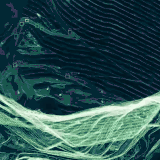
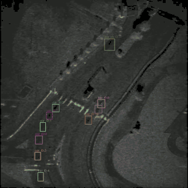

# VSMB
VSMB: Video SAR MOT BenchMark.

VSMB consists of 45 videos and 4,394 images, covering 25,466 target instances and 355 trajectories.

[//]: # (VSMB constructed in this study includes video clips from various representative scenarios that are freely and publicly released by ICEYE, SNL, AIRSAT, and SS &#40;Smart Satellite&#41;.)

## 📰 News

**May 22, 2025** — The letter has been submitted to *IEEE Geoscience and Remote Sensing Letters (GRSL)*.  

The dataset and baseline model will be released once the manuscript is accepted. Stay tuned!

Note: We have compressed the video length and quality in order for github to display the images as quickly as possible!

## 🎥 examples
### 🔹 Mine
Bingham Canyon Mine,Utah

---

### 🔹 Transport
Eubank Gate and Traffic

---

## 📄 License

This project is licensed under the MIT License.
